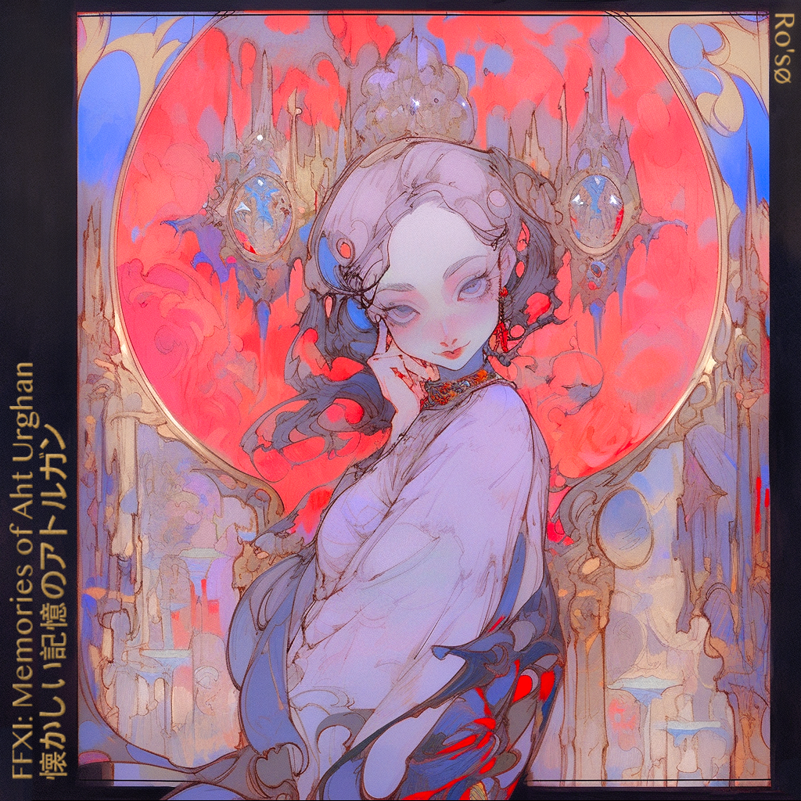

# FFXI - Memories of Aht Urghan・懐かしい記憶のアトルガン
*Status: Complete*
*Release Date: TBD*
## Summary
In early 2023 I was offered the chance to remake FFXI's [Treasures of Aht Urghan OST](https://www.discogs.com/release/10603706-Naoshi-Mizuta-Nobuo-Uematsu-Final-Fantasy-XI-Treasures-Of-Aht-Urhgan-Original-Soundtrack-ファイ) by the [HorizonXI](https://horizonxi.com) team. Having played FFXI between the years of 2003 and 2006, I had a lot of nostalgia for the game and for [Naoshi Mizuta](https://en.wikipedia.org/wiki/Naoshi_Mizuta)'s FFXI soundtracks. I jumped at the chance to do so and in doing so I produced a nostalgically faithful, forward sounding orchestral remake. Check it out on all major streaming platforms.

## Album Art

## Extras
I've made a post describing my intentions behind this work and some of the thoughts that went into producing it. [Take a look at it here.]

## Comments
