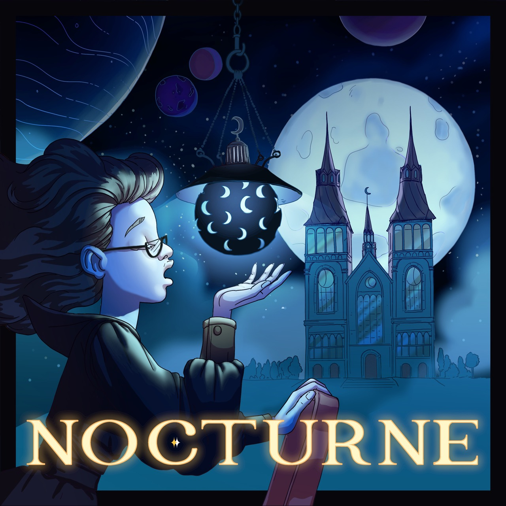

# Tales of Nocturne

_Night Time Fantasy Fiction Podcast. [New Episodes Every Full-Moon(ish)](https://www.rmg.co.uk/stories/topics/full-moon-calendar)._   
## Summary
A Lunar Priest tired of being alone, an inventor following a new thread of songlight investigation, and a Mycologist caught up in the politics of The Midnight City's most ramshackle research institute. Tales of Nocturne follows the lives of those who liv eon Nocturne - the planet of eternal night surround by magical moons that waltz across the sky. 

Tales of Nocturne is a night-time fiction podcast - a podcast design to help one fall asleep. Engaging enough to tune in but just gentle enough to lull one to sleep. If you're an anxious sleeper who listens to podcasts before bed then I encourage you to give it a try. Relax as we explore their world so you can rest in yours. 

Sweet dreams. 🌕

## Show Art

Art by [Anne Sigismund](https://www.annesigismund.com)

## Where to Listen
Find the show anywhere podcasts are found but also here for your convenience:

<iframe id="embedPlayer" src="https://embed.podcasts.apple.com/us/podcast/tales-of-nocturne/id1646255875?itsct=podcast_box_player&amp;itscg=30200&amp;ls=1&amp;theme=auto" height="450px" frameborder="0" sandbox="allow-forms allow-popups allow-same-origin allow-scripts allow-top-navigation-by-user-activation" allow="autoplay *; encrypted-media *; clipboard-write" style="width: 100%; max-width: 660px; overflow: hidden; border-radius: 10px; transform: translateZ(0px); animation: 2s ease 0s 6 normal none running loading-indicator; background-color: rgb(228, 228, 228);"></iframe>

